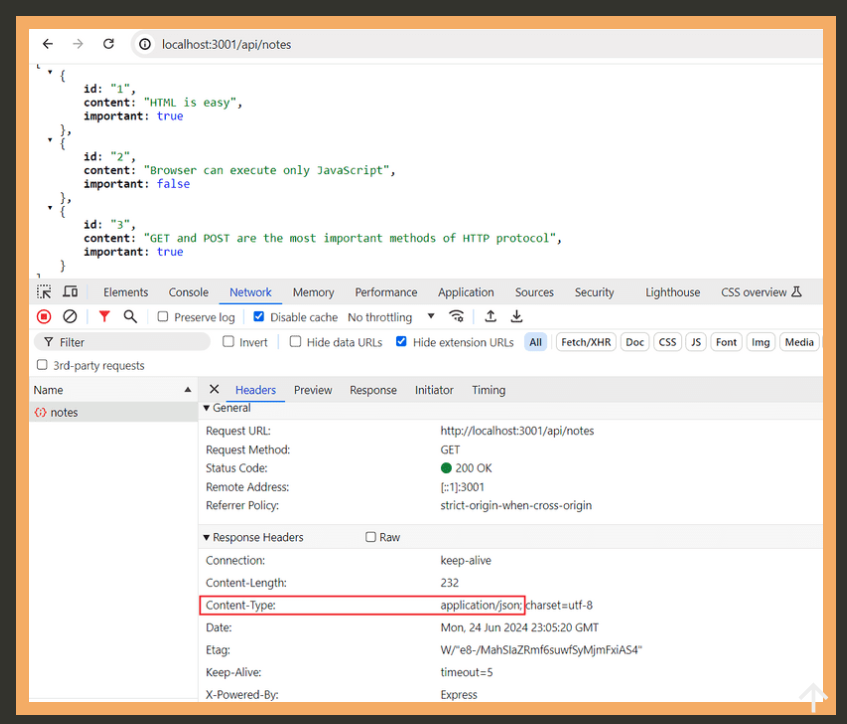

Just to start to taking notes. 

In this part, our focus shifts towards the backend: that is. towards implementing functionality onn the server side of stack.

We will be building our backend on tope of **Node.JS**, which is a Javascript runtime based on Googles's Chrome V8 Javascript engine.

....

As i mentioned in part1, browsers don't yet support the newest features of Javascript, and that why is the code running in the browser must be transpiled with e.g. <ins> babel </ins>. The situation with Javascript running in the backend is different. The newest version of Node supports of the latest features of Javascript, so we can use the latest features without having to transpile our code.

Our goal is to implementn a backend that will work with the notes application from part 2. However, let's start with the basics by implementing a classic "hello world" application. 


......

**Express**

Implementing our server code directly wuth Node's built-in http web server os possible . However, it is cumbersome, especially once the application grows in size.

,,,,

app.get('/api/notes', (request, response) => {
  response.json(notes)
})

The request is responded to with the json method of the response object. Calling the method will send notes array that was passed to it as a JSON fomratted string. Express automatically sets the Content-Type header with the appropriate valu of aplication/json. 



next, let's take a quick look at the data sent in JSON format. 

In the earlier version where only using Node, we had to transform the data into JSON formatted string with the JSON.stringify method.

```javascript
response.end(JSON.stringify(notes))
```

with Express , this is no longer required, because this transformation happens automatically. 

It's worth nothing that JSON is a string and not a JavaScript object like the value assigned to notes.

....

REST 

Let's expand our application so that ir provides the same RESTful HTTP API as <ins> json-server</ins>

Representational state transfer aka rest, was introduced in 200 in Roy Fielding's dissertation. Rest is an architectural style meant fir building scalable web applications .

We mentioned in the previous part that singular things, like notes in the case of our application, are called resources in RESTful thinking. Every resource has an associate URL which is the resource's unique address.

